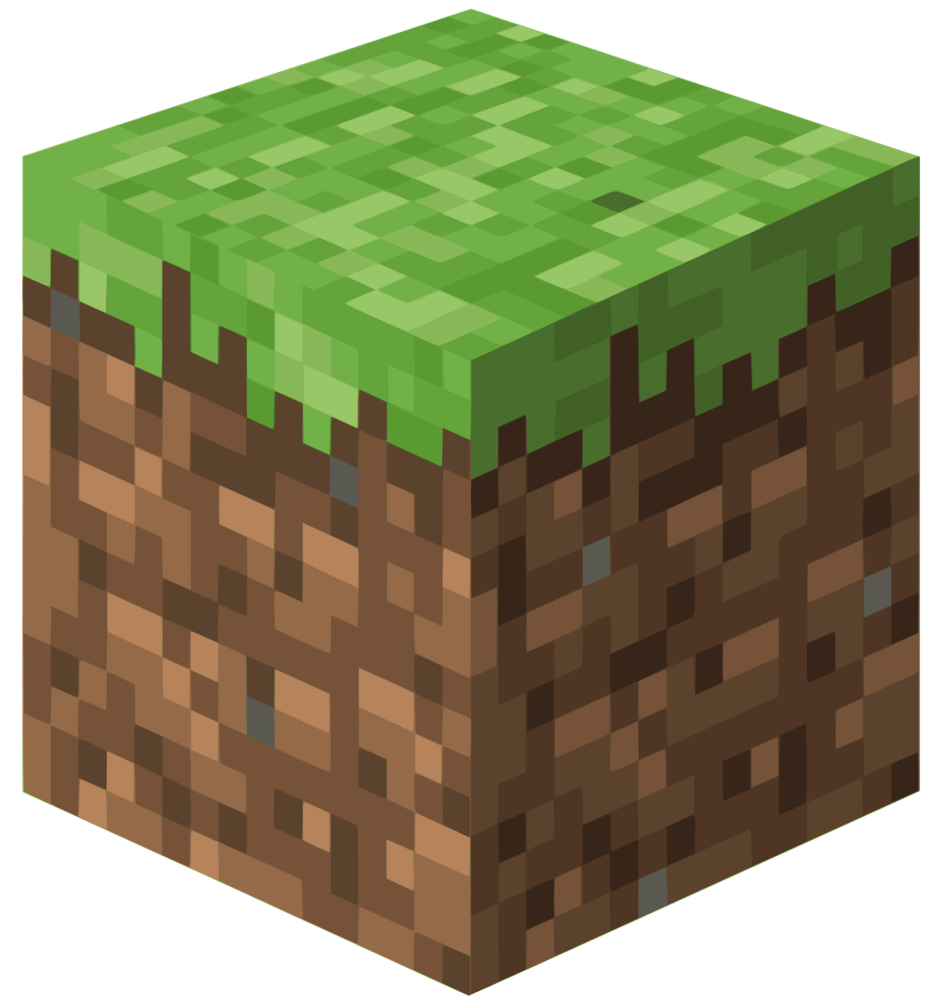

<div align="center">
    <p><a href="#"><a href="https://ollama.com/"></a></a><a href="https://www.minecraft.net/"></a></p>
    <h1>Minecraft AI Companion</h1>
    <h3><a href="#"></a>Ollama in your Minecraft World</h3>
    <p><a href="#"></a><a href="https://www.gnu.org/licenses/gpl-3.0.en.html"></a>
    <a href="#"></a><a href="https://github.com/D-Squad-Studios/minecraft-ollama/releases/latest"></a>
    <!-- <a href="#"></a><a href="https://github.com/D-Squad-Studios/minecraft-ollama/actions/workflows/sample.yml"></a> -->
</div>

## About/Goals
It would be awesome to implement [Ollama](https://ollama.com/) into Minecraft as a Mod/Plugin where you can talk to villagers and have a model that can watch your world and provide context to the player about what is happening in their world (this is why it will be called the Overseer). Another cool thing to do is to add events into the world for the NPCs to talk about!

* [ ] Implement Ollama into minecraft to interact with the player (kind of like an AI pal)
  * [ ] World Events context
  * [ ] Nearby villages context
  * [ ] Village context
    * For example, village was attacked my mobs, village built iron golem, village was raided
  * [ ] Villager context
    * For example, a villager can see a player, villager's friend died in the middle of the night

> [!NOTE]
> Conversations likely limited to villagers with jobs 

## Quick Start

### Prerequisites
- **Java 21** (JDK)
- **[Ollama](https://ollama.com/)** installed and running locally.
    * Make sure port 11434 is open on your computer. If port 11434 is in use, you can specify a different port in the Ollama setting by updating the `baseUrl` in `src/main/java/net/kevinthedang/ollamamod/chat/OllamaSettings.java`. You can also change your Ollama endpoint if it is not running locally. By default, the mod expects Ollama to be available at `http://localhost:11434`.
- **Git**

### Setup

1. **Clone the repository**
   ```bash
   git clone https://github.com/CS26-13/minecraft-ollama.git
   cd minecraft-ollama
   ```

2. **Pull the required Ollama models**
   ```bash
   ollama pull granite4:latest
   ollama pull minimax-m2.5:cloud
   ollama pull nomic-embed-text:latest
   ```

3. **Set up Ollama service**
    * Open the Ollama application and navigate to the `Settings` section. 
    * Make sure to enable "Expose API to the network" to allow the mod to communicate with the Ollama server. 
    * Depending on your computer performance, adjust the context length as needed. We recommend 16,000 tokens or more for better conversations, but you can start with a smaller context length if you encounter performance issues.
    * Log in to your Ollama account within the application to access cloud models like `minimax-m2.5:cloud`.
    * Then, either keep the Ollama application running or run the command below in the terminal to start Ollama.
   ```bash
   ollama serve
   # If you run this command, leave the terminal open to keep Ollama running. You can stop Ollama later by pressing Ctrl+C in that terminal. Open another terminal for the next steps.
   ```


5. **Extracting and Organizing Minecraft Knowledge Base** (Only required to run once unless there is an update. Run at project root)

   ```bash
   npm install minecraft-data
   node tools/brewing_recipes.js
   node tools/minecraft_data_extractor.js
   ```

6. **Seed the vector store** (Minecraft knowledge base for villager conversations. Only required to run once unless there is an update. Run at root of the project)
   ```bash
   ./gradlew seedData --args="--ingest tools/seed-documents"
   ```

7. **Launch the game**

   ```bash
   ./gradlew runClient
    ```

8. **Chat with a villager** — find a villager, open the trade screen, and click the **"Chat"** button.

### Running Tests

macOS / Linux:
```bash
./gradlew test                       # All tests (requires Ollama running)
./gradlew test -PdisableOllamaTests  # Unit tests only
```

## Mod vs Plugin?
* A ModPack will disassemble and assemble the game code to add something new into it when building the game.
* A Plugin respects the game code but adds on top of it, it can modify in this tree:
  * data
    * (namespace)
      * advancements (*.json)
      * functions (*.mcfunction)
      * item_modifiers (*.json)
      * loot_tables (*.json)
      * predicates (*.json)
      * recipes (*.json)
      * structures (*.nbt)

## Resources
* [Minecraft Forge](https://github.com/MinecraftForge/MinecraftForge)
* [Forge Modding Tutorials](https://moddingtutorials.org/)
* [Minecraft Wiki](https://minecraft.wiki/) for NPC interactions
  * [Structure](https://minecraft.wiki/w/Structure)
  * [Village](https://minecraft.wiki/w/Village)
    * [Villager](https://minecraft.wiki/w/Villager)
    * [Iron Golem](https://minecraft.wiki/w/Iron_Golem)
  * [Pillager Outpost](https://minecraft.wiki/w/Pillager_Outpost)
    * [Pillager](https://minecraft.wiki/w/Pillager)
* [Java Intro with Minecraft Modding](https://www.youtube.com/playlist?list=PLKGarocXCE1FeXvEogpjz4SvHxF_FJRO6)
* [Forge 1.20.X Tutorials](https://www.youtube.com/playlist?list=PLKGarocXCE1H9Y21-pxjt5Pt8bW14twa-)
  * [1.19.X Tutorials](https://www.youtube.com/playlist?list=PLKGarocXCE1HrC60yuTNTGRoZc6hf5Uvl)
